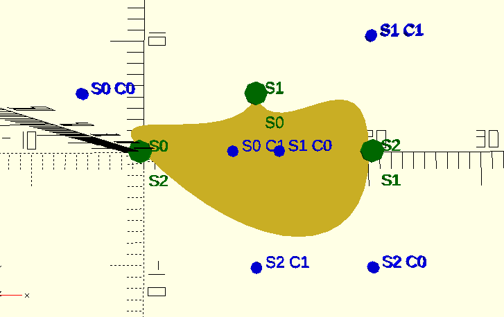

# Bezier Curve Library

This library provides several functions for calculating Bezier curves given an array of control points in OpenSCAD. (See https://en.wikipedia.org/wiki/Bezier_curve for more info)

## Usage

Include this library in your OpenSCAD project.

	include <bezier.scad>

Example of a complete looped path of Bezier curves. There are 3 segments, each having an endpoint, 2 control points, and another endpoint.

	//array of Bezier segments
	points = [
		[[0, 0], [-5, 5], [8, 0], [10, 5]],
		[[10, 5], [12, 0], [20, 10], [20, 0]],
		[[20, 0], [20, -10], [10, -10], [0, 0]]
	];
	//calculate an actual path for OpenSCAD to use natively
	path = B_path(points, fn=16);
	//usage of final path
    polygon(path);

## Segments

Each segment in this library can have an array of 1-4 points.

Lengths:
* 1 - [endpoint], no internal calculations needed
* 2 - [endpoint, endpoint], no internal calculations needed
* 3 - [endpoint, control point, endpoint], uses *B_quadratic()* to calculate intermediate points
* 4 - [endpoint, control point, control point, endpoint], uses *B_cubic()* to calculate intermediate points

## Endpoints and Control points

Each endpoint or control point is a set of (x,y) coordinates. An array of up to 4 endpoints or control points make up a *segment*.

## Functions

### B_path(segments, fn)

This function returns an array of points based on the array of segments. This is the only function that should be directly used.

**Parameters**

* segments - list of segments, each segment being a set of coordinates with a length 1-4
* fn - controls how many intermediate points will make up each curve in the path, default 32

### B_debug(segments, fn)

This function can be used to help debug Bezier curves. It renders text and dots in the OpenSCAD view panel

**Parameters**

* segments - list of segments, each segment being a set of coordinates with a length 1-4
* size - text size